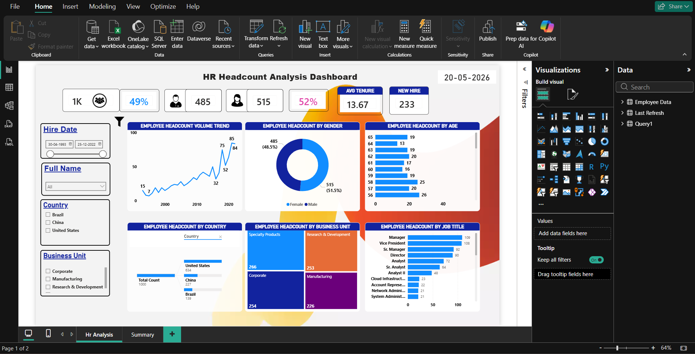
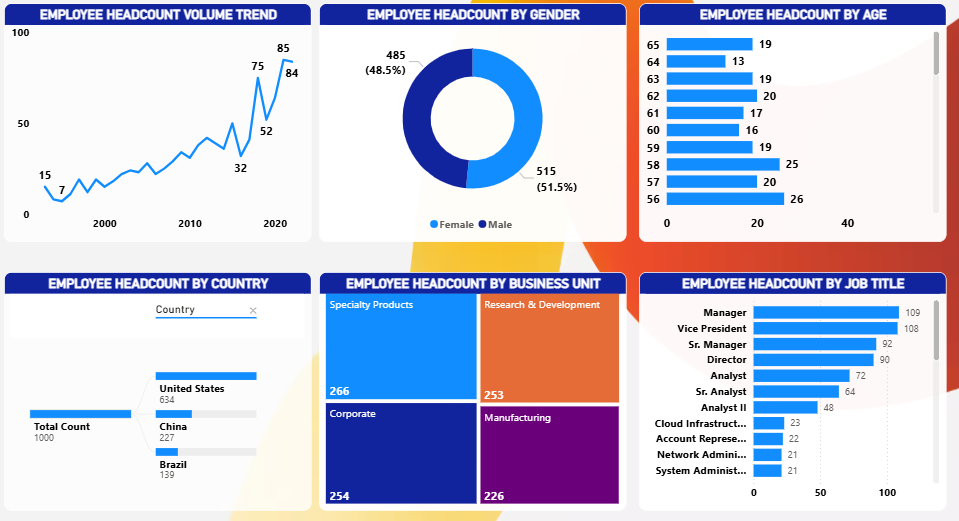
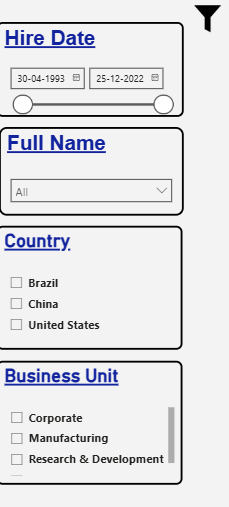
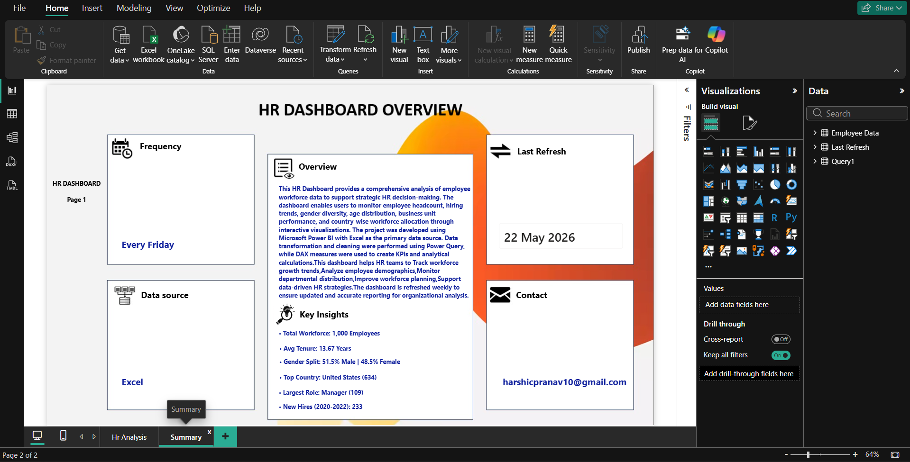

# HR Analytics Dashboard (Power BI)

Interactive HR Analytics Dashboard built in Power BI to analyze employee attrition and workforce trends using the Employee Sample Data (1,000 employee records).

## 📊 Dashboard Preview

**Overview**

**Workforce Trends**

**Filters & Interactivity**

**Summary View**

## 🔍 Key Insights

- Identified departments and job roles with the highest attrition rates
- Analyzed attrition trends by age group, tenure, and monthly income
- Surfaced correlation between overtime, job satisfaction, and employee exits
- Built a filterable, single-page executive view for quick decision-making

## 🛠 Tools & Techniques

- **Power BI**: Data modeling, DAX measures, interactive visuals
- **DAX**: Custom measures for attrition rate, average tenure, and satisfaction scores
- **Data Modeling**: Star schema design for optimized report performance
- **Power Query**: Data cleaning and transformation

## 📁 Files in this Repo

| File | Description |
|---|---|
| `HR Dashboard Preparation.pbix` | Full Power BI file (open in Power BI Desktop) |
| `HR Dashboard Preparation(PDF).pdf` | Static PDF export — view without Power BI installed |
| `dashboard_overview.png` | Screenshot of main dashboard page |
| `Workforce_trends.png` | Screenshot of workforce trends page |
| `dashboard_filter.png` | Screenshot showing filter/slicer interactivity |
| `dashboard_summary.png` | Screenshot of summary view |
| `Employee Sample Data.xlsx` | Source dataset used for the dashboard |

## 📌 Dataset

`Employee Sample Data.xlsx` — employee-level dataset covering demographics, job details, compensation, and attrition status, used as the data source for this dashboard.

## 👤 Author

**Harshic Pranav P J**
Data & Procurement Analyst | Aspiring Data/Business Analyst
[LinkedIn- https://www.linkedin.com/in/harshicpranav10] 
[portfolio -https://vine-bayberry-c2d.notion.site/Harshic-Pranav-393d871aee2f80798610e17239a7df12?source=copy_link]
